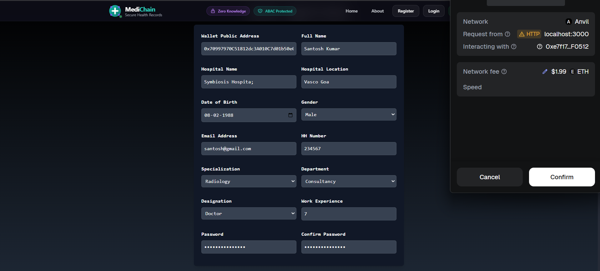
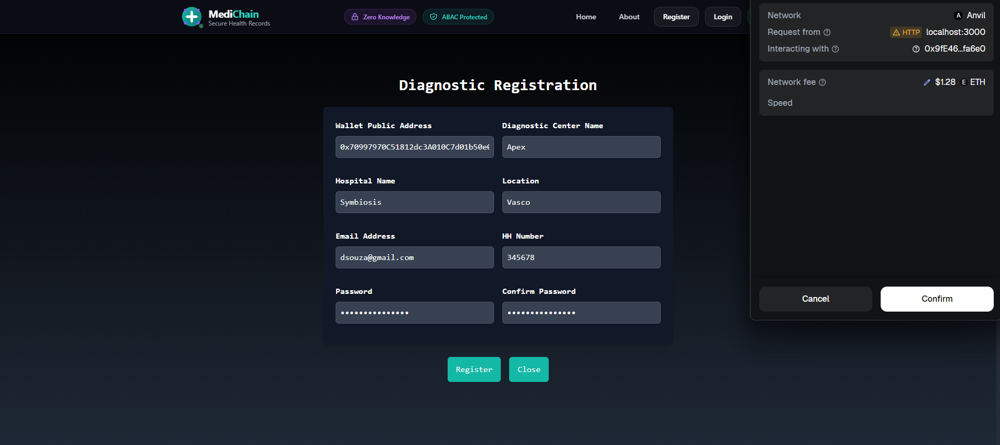
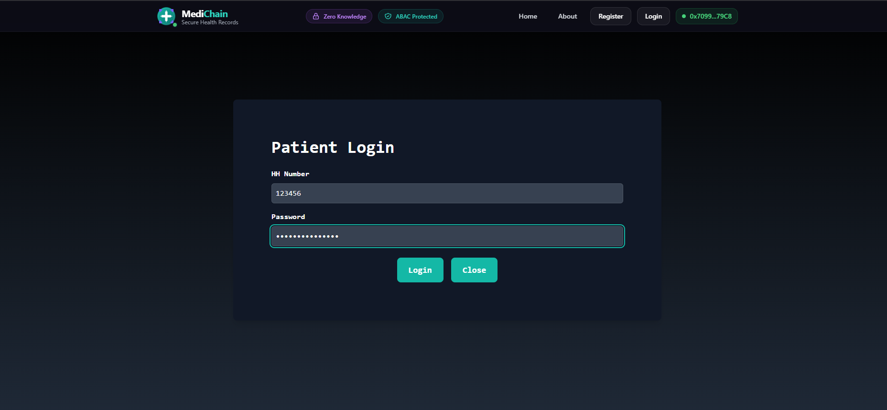
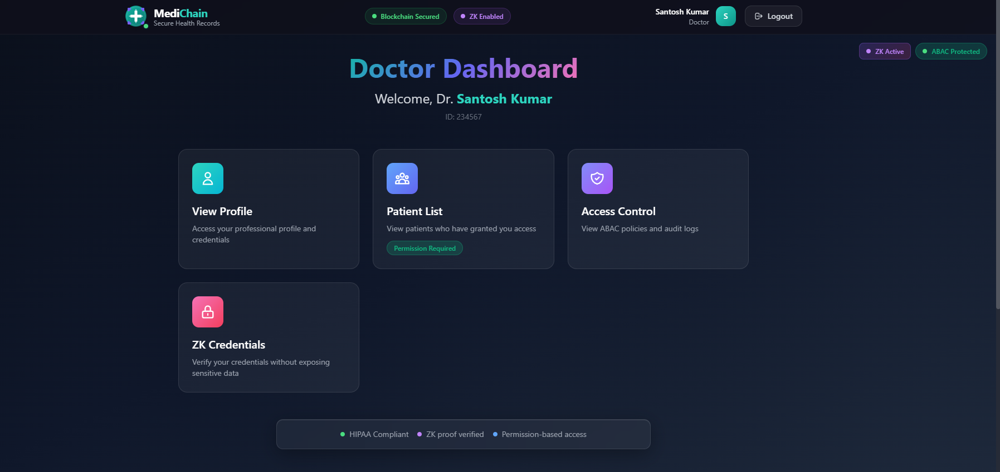
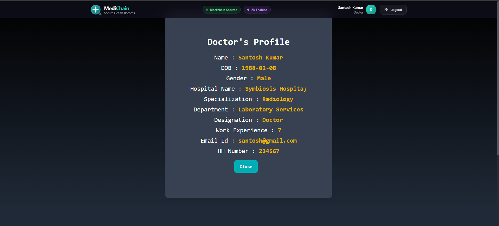
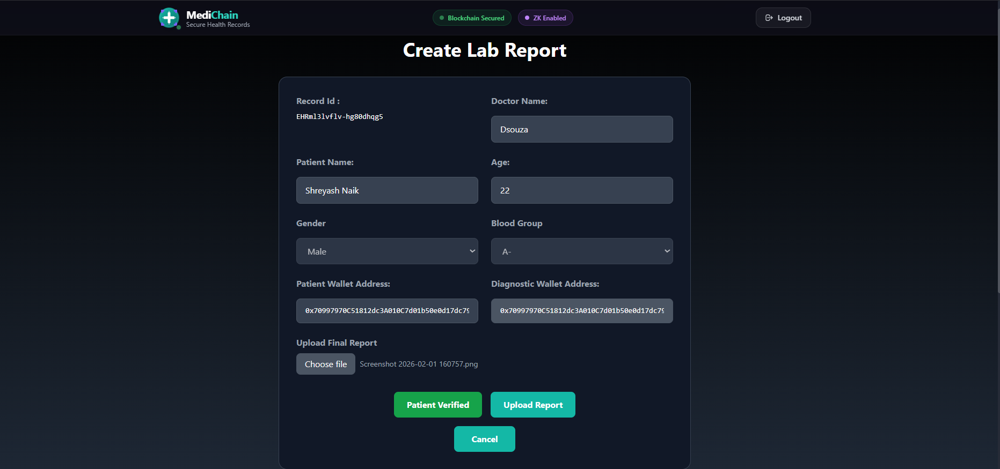

# MediChain - Secure Electronic Health Records

A blockchain-based healthcare data management system with **Zero Knowledge proofs** and **Attribute-Based Access Control (ABAC)**.

This project enables patients to securely upload medical data, manage doctor access, and view historical data. Doctors can manage patient lists, access records, generate consultancy reports, and revoke patient access. Diagnostic centers can create EHR reports with IPFS integration.

## Technologies Used

- **Blockchain:** Ethereum (Solidity 0.8.19)
- **Development Framework:** Foundry (Forge, Anvil, Cast)
- **Local Blockchain:** Anvil (replaces Ganache)
- **Wallet:** MetaMask
- **Decentralized Storage:** IPFS
- **Frontend:** React 18, Tailwind CSS, Web3.js
- **Security:** Zero Knowledge Proofs, ABAC

## Security Features

- **Zero Knowledge Proofs**: Verify attributes without revealing sensitive data
- **ABAC Access Control**: Fine-grained permission management based on user attributes
- **Blockchain Security**: Immutable health records on Ethereum
- **Patient-Controlled**: Patients manage who can access their data


## Screenshots:

### HomePage:







---

### Login:



---

### Patient Side:


---

### Doctor Side:






---

### Diagnostic Side:



---

### Report View for Patient and Doctor:


---

## Requirements

1. **Node.js** (v16 or later): [Download](https://nodejs.org/en/download/)

2. **Foundry** - Install from terminal:
   ```bash
   curl -L https://foundry.paradigm.xyz | bash
   foundryup
   ```

3. **MetaMask Extension**: [Chrome Web Store](https://chrome.google.com/webstore/detail/metamask/nkbihfbeogaeaoehlefnkodbefgpgknn)

4. **IPFS (Optional)**: [Download Kubo](https://dist.ipfs.tech/#go-ipfs)

---

## Quick Start

### 1. Install Dependencies

```bash
npm install
```

### 2. Start Anvil (Terminal 1)

```bash
npm run anvil
```

This starts a local blockchain at `http://127.0.0.1:8545` with Chain ID `31337`.

### 3. Deploy Contracts (Terminal 2)

```bash
npm run deploy
```

### 4. Start Frontend (Terminal 3)

```bash
npm start
```

Open [http://localhost:3000](http://localhost:3000)

### 5. Configure MetaMask

Add Anvil network:
- **Network Name:** Anvil Local
- **RPC URL:** http://127.0.0.1:8545
- **Chain ID:** 31337
- **Currency:** ETH

Import a test account using Anvil's private key (shown when Anvil starts).

---

## Available Commands

| Command | Description |
|---------|-------------|
| `npm run anvil` | Start Anvil local blockchain |
| `npm run deploy` | Build and deploy contracts to Anvil |
| `npm run forge:build` | Build contracts only |
| `npm start` | Start React dev server |

Or use Make:
```bash
make help      # Show all commands
make anvil     # Start blockchain
make deploy    # Deploy contracts
make frontend  # Start React app
```

---

## Project Structure

```
ehr/
├── contracts/           # Solidity smart contracts
├── scripts/             # Deployment scripts (Node.js)
├── src/
│   ├── components/      # React components
│   ├── context/         # SecurityContext (ZK + ABAC)
│   ├── utils/           # zkProofs.js, abacEngine.js
│   └── config/          # web3Config.js
├── foundry.toml         # Foundry configuration
└── package.json
```

